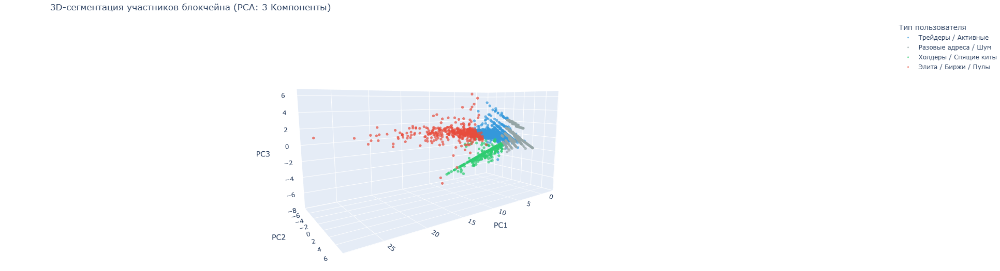

# Методы группировки участников блокчейна на основании открытых данных

## Описание проекта
Данный репозиторий содержит практическую реализацию дипломной работы по исследованию графа транзакций сети Bitcoin. В проекте реализован полный цикл аналитики (End-to-End): от извлечения сырых данных из узла Bitcoin Core до применения методов машинного обучения для профилирования и деанонимизации участников сети.

Ключевая особенность: использование стека NVIDIA RAPIDS для переноса всех вычислений на GPU, что позволило обрабатывать миллионы транзакций в десятки раз быстрее классических методов на CPU.

## Структура репозитория

### 1. Модуль сбора данных (ETL) — `/scripts`
Скрипты на Python для взаимодействия с Bitcoin Core через JSON-RPC API.
* `extract_data/` — извлечение сырых блоков.
* `save_to_csv/` — парсинг транзакций и сохранение в плоские таблицы.
* `benchmark/` — профилирование производительности выгрузки.

### 2. Модуль аналитики и ML — `/notebooks`
Jupyter-ноутбуки с реализацией математических моделей.
* `01_eda_and_stats.ipynb` — разведочный анализ данных сети.
* `02_clustering_heuristics.ipynb` — детерминированные графовые эвристики деанонимизации (Common Input & Change Address).
* `03_feature_engineering.ipynb` — конструирование признаков и формирование профилей (досье) сущностей.
* `04_behavioral_clustering.ipynb` — алгоритмы ML без учителя (K-Means, DBSCAN) для поиска аномалий (бирж, миксеров, пулов).
* `01_GPU_Data_Preparation.ipynb` — Полный цикл высокопроизводительной обработки данных. 
  Включает в себя:
  - Оптимизация Star-Graph: Алгоритмическое решение проблемы MemoryError при объединении адресов.
  - Feature Engineering: Трансформация сырых данных в профили участников с использованием логарифмического сглаживания и стандартизации.
  - Макро-сегментация (K-Means): Глобальное разделение сети на функциональные группы (Биржи, Холдеры, Шум).
  - Микро-сегментация (DBSCAN): Поиск скрытых аномалий и высокоплотных бот-сетей внутри кластера крупных игроков.
  - Визуализация (PCA 3D): Интерактивное представление структуры блокчейна в трехмерном пространстве главных компонент.
 
  

### 3. Данные — `/data`
Тестовый набор данных (6 исторических блоков), на котором можно запустить и проверить работу всех Jupyter-ноутбуков.
Из-за ограничений GitHub на размер файлов, основной датасет доступен по ссылке:
[Скачать bitcoin_clustered_users.csv](https://drive.google.com/file/d/1sVuW8TnLED9ritEYWuojcPJfjHrZTbTB/view?usp=sharing)
